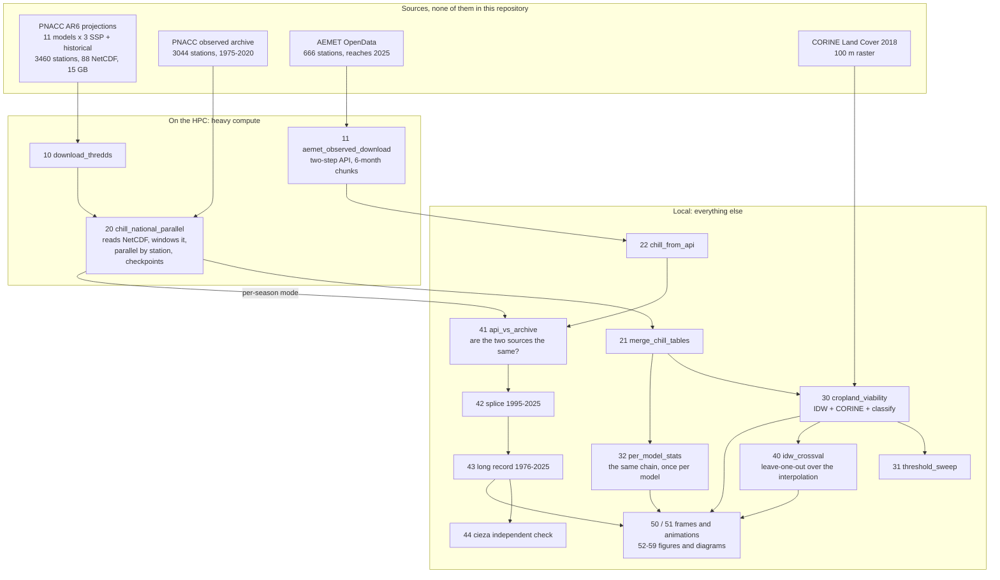

# Winter chill projections for apricot in Spain, 1976-2100

**'Búlida'** is the dominant apricot cultivar of south-eastern Spain and needs **47.5 chill
portions** before its buds can respond to spring warmth. **'Búlida Precoz'** is a spontaneous bud
sport of it, genetically indistinguishable across more than sixty markers, that needs **33.7** and
blooms about seventeen days earlier. Those **13.8 chill portions** between the two are what this
pipeline maps onto the ground.

The question it answers: where does 'Búlida' stop meeting its requirement while the mutant still
meets its own, and how does that band of land move through the century?

This is the code behind a talk at the 19th Plinius Conference on Mediterranean Risks (session PL6,
Murcia, 8 October 2026). It computes winter chill from Spanish station data, observed from 1976 to
2025 and projected to 2100 under three CMIP6 scenarios, and reports the answer as **area of
cultivable land** rather than as a count of weather stations.

> Work in progress towards the talk. The numbers below are current as of August 2026 and reconcile
> with the tables in `02_outputs/`.

---

## Result

Of Spain's 229,676 km² of cropland, at 2071-2100 under SSP3-7.0:

| | km² | |
|---|---:|---|
| 'Búlida' stops being viable on | **45,103** | 19.6% of cropland |
| of which 'Búlida Precoz' still works on | **23,310** | **51.7% of the loss** |
| neither cultivar viable | 21,794 | 9.5% of cropland |

Across the eleven models the rescued fraction runs from 39.1% to 82.1%. That range rests on the
*gap* between the two cultivars rather than on either absolute threshold, which is why it is firmer
than the areas themselves.

---

## Setup

```bash
git clone <this repo> && cd <this repo>
Rscript install_deps.R                       # 18 R packages; see the file for the chillR recipe
conda env create -f environment.yml          # Python side, only for scripts 11, 12, 51, 62, 63
export PLINIUS_DATA=/path/to/plinius_data    # where the input data lives
```

Read [`00_data/README.md`](00_data/README.md) next: the input data is not here and cannot be, and
that file says how to obtain each source. Every script fails on its first line with instructions
rather than halfway through with something cryptic.

```bash
Rscript 01_scripts/30_cropland_viability_national.R   # interpolate, cross with CORINE, classify
```

That one runs from `02_outputs/chill_all_windows.csv`, which is in this repository, so the maps and
the areas above reproduce without access to the cluster.

---

## Pipeline



Reading 15 GB of NetCDF and computing chill for 3460 stations across 45 model-scenario combinations
takes about a day, so it happens where the data lives; what comes back are chill tables of a few
megabytes.


---

## Parameters

Each value is read from the line named beside it, so any of them can be checked against the code in
one step.

| | Value | Set at |
|---|---|---|
| Chill model | Dynamic Model, Fishman et al. (1987) parametrisation | `DM_JOSE.R:4-5` |
| Model constants | E0 4457.8, E1 10161.9, A0 419700, A1 1.797e14, slope 1.6, Tf 277 | `DM_JOSE.R:4-5` |
| Chill season | Julian day 305 to 59, 1 November to 28 February | `20_chill_national_parallel.R:116` |
| Safe Winter Chill | 10th percentile of seasonal chill portions, across seasons within a station | `15_...:346` |
| Season kept if | at least 85% of days present | `15_...:116, :339` |
| Station kept if | no more than 40% missing in either variable, and 3 or more valid seasons | `15_...:117, :344` |
| Fill-value guard | values outside -90 to 70 C masked; four models ship -999 undeclared | `15_...:118, :271` |
| Baseline splice | historical to 2014, then SSP2-4.5 from 2015 | `15_...:159, :295-302` |
| Analysis windows | 1995-2020, then 2021-2040, 2041-2070, 2071-2100 | `15_...:126-132` |
| Ensemble statistic | median across the 11 models, at the station, before interpolation | `30_cropland_viability_national.R:66` |
| Interpolation | IDW, power 2, 50 km radius, at most 12 neighbours; the radius *is* the mask | `19_...:43-45, :151` |
| Grid | 1 km, EPSG:3035; cell area from the realised resolution, not the nominal one | `19_...:37-40`, `00_corine.R:43` |
| Cropland | CORINE 2018 classes 211-244 excluding 231; each cell weighted by its cropland fraction | `00_corine.R:24-28` |
| Cultivar thresholds | 47.5 and 33.7 chill portions, both with a standard error of 3.3 | `19_...:41-42` |
| Model agreement | hatched where fewer than 9 of 11 models agree on the class, the AR6 80% convention | `00_hatch.R:28, :107-113` |

---

## Contents of 02_outputs

| | What it holds |
|---|---|
| `chill_all_windows.csv` | The table everything else comes from. 462,808 rows, one per station, model and situation: station id and coordinates, the scenario and the time window with its period, how many seasons passed the completeness filter, and for each combination the mean chill portions, the Safe Winter Chill (the 10th percentile across those seasons), and the same two in Utah chill units. 3,460 stations x 11 models x 12 situations, plus the observed rows |
| `chill_obs_seasons.csv`, `chill_obs_seasons_1975.csv` | The observed record season by season, from the PNACC archive. The 1975 file is the long version behind the fifty-winter series |
| `chill_api_seasons.csv` | The same shape, computed from the AEMET OpenData download that extends the record to 2025 |
| `idw_crossval.csv` | Leave-one-out error of the interpolation, station by station |
| `pipeline_runs.csv`, `station_walkthrough_km2.csv` | The model x experiment x window combinatorics, and one station followed through the whole chain |
| 38 metric tables | One or two kilobytes each, `(metric, value)` pairs. Every figure in the talk reads its numbers from one of these at build time rather than having them typed in |

Not here: the per-window chill runs, which `21_merge_chill_tables.R` merges into
`chill_all_windows.csv`; the raw AEMET API download, superseded by the seasonal tables above; the
figures and the animations, rebuilt by scripts 30 and 50 to 59; and the station coordinates
compiled by the regional agrometeorological services, which arrived through a third party with no
terms of transfer.

---

## Scripts

All in [`01_scripts/`](01_scripts/). The number says which stage a script belongs to, and there is
room inside each block for the next one. Every file carries a header stating what it does, what it
needs and what it writes.

| | Script | Runs on | What it does |
|---|---|---|---|
| **00 shared** | `00_paths.R` | — | Resolves every path; sourced by the rest |
| | `00_corine.R`, `00_hatch.R`, `00_map_layout.R` | — | Cropland mask and cell area, AR6 agreement hatching, figure geometry |
| | `DM_JOSE.R` | — | The chill model. Not in this repository, see below |
| **10 acquisition** | `10_ladon_download_thredds.sh` | HPC | 88 NetCDF from THREDDS |
| | `11_aemet_observed_download.py` | HPC | AEMET OpenData, resumable, two-step API |
| | `12_pnacc_to_tables.py` | local | NetCDF to tidy per-station tables |
| | `13_ladon_checksums.sh` | HPC | md5 manifest of the 88 NetCDF, so a later download can be compared against this one |
| **20 chill** | `20_chill_national_parallel.R` | HPC | **The chill engine.** Windows, splicing, checkpoints |
| | `21_merge_chill_tables.R` | local | Merges the runs into `chill_all_windows.csv` |
| | `22_chill_from_api.R` | local | Chill per season from the OpenData CSVs |
| **30 surface** | `30_cropland_viability_national.R` | local | IDW, CORINE, classification, maps |
| | `31_threshold_sweep_cropland.R` | local | Viable km² for any chill requirement |
| | `32_per_model_stats.R` | local | The whole chain repeated once per model, and the agreement rasters |
| **40 checks** | `40_idw_crossval.R` | local | Leave-one-out error of the interpolation |
| | `41_observed_api_vs_archive.R` | local | Paired comparison of the two observed sources |
| | `42_splice_observed_1995_2025.R` | local | The splice and its effect |
| | `43_observed_long_record.R` | local | 1976-2025: trend, ranking, blocks |
| | `44_cieza_independent_check.R` | local | Check against a series outside the AEMET network |
| **50 figures** | `50_scenario_frames.R`, `51_make_gifs.py` | local | Animation frames and the GIFs built from them |
| | `52` to `59` | local | Talk and didactic figures, the model figures, the pipeline diagram, the attrition funnel, the data timeline, the model ranking |
| **60 Murcia test-run** | `60_chill_murcia.R`, `61_chill_maps_murcia.Rmd` | local | Regional chill and its report |
| | `62_cropland_filter.py`, `63_soil_decision_map.py`, `64_soil_criterion_compare.R` | local | Soil criterion by CORINE buffer, and the comparison that settled it |
| | `65` to `68` | local | Cropland maps at 500 m and 100 m, national and regional |

The 60s came first in time: they are the test-run over Murcia that fixed the method before it was
run nationally.

Script 20 carries several protections that exist because of failures that actually happened: a
checkpoint per model-scenario combination written atomically, a sentinel that refuses to save a
combination where a parallel worker died, a reader that detects the NetCDF layout instead of
assuming it, and a mask for undeclared `-999` fill values.

---

## Not included

**The input data.** Gigabytes, third-party licences. [`00_data/README.md`](00_data/README.md) says
how to obtain each source.

**The chill model.** `DM_JOSE.R` is not mine, so it is not uploaded here. Request it from
J. A. Egea, jaegea@cebas.csic.es.
