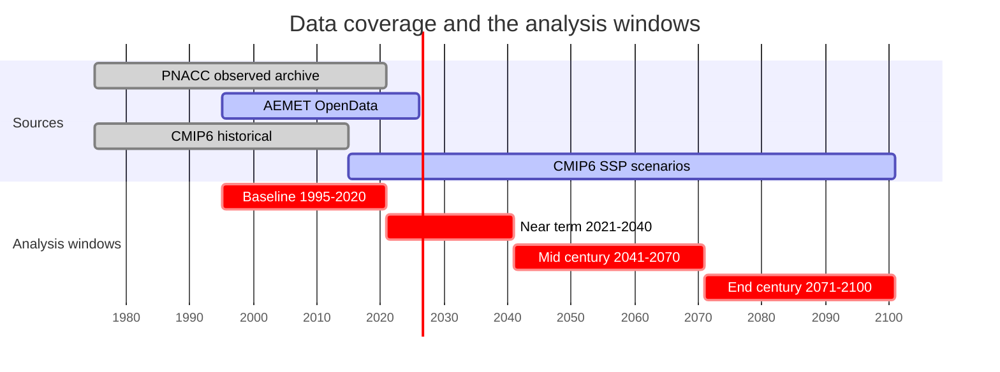
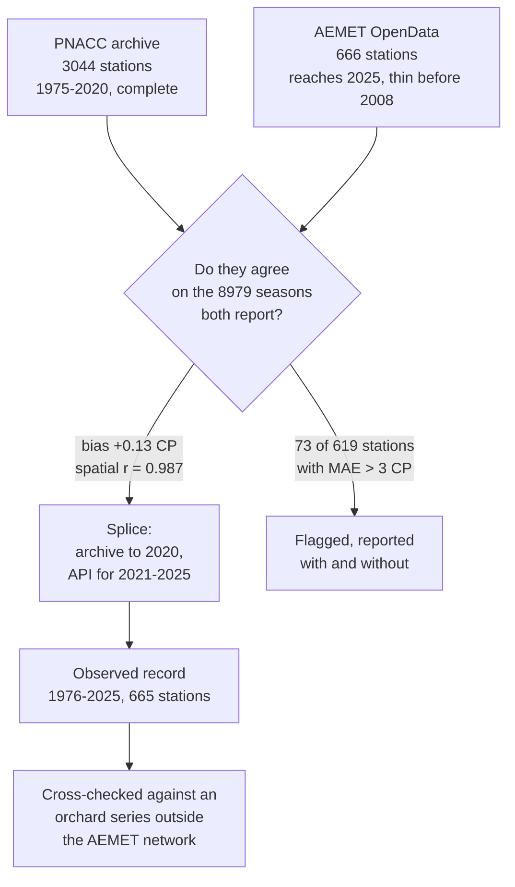

# Winter chill for apricot in Spain, and what a low-chill mutant buys

Where does the apricot cultivar **'Búlida'** stop meeting its winter chill requirement while its
somatic mutant **'Búlida Precoz'** still meets its own, and how does that band of land move through
the century?

This repository holds the code behind a talk at the **19th Plinius Conference on Mediterranean
Risks** (session PL6, Murcia, 8 October 2026). It computes winter chill from Spanish station data,
observed from 1976 to 2025 and projected to 2100 under three CMIP6 scenarios, and expresses the
answer as **area of cultivable land** rather than as a count of weather stations.

> **Status.** Work in progress towards the talk. The numbers below are current as of August 2026
> and reconcile with the tables in `02_outputs/`.

**In a hurry?** [`03_presentacion/plinius_workflow.pdf`](03_presentacion/plinius_workflow.pdf) is
the whole pipeline on one page: the four data sources with their real dimensions, which step runs
on the cluster and which locally, every operative parameter with the line of code that sets it,
and a thumbnail of what each stage produces. Rebuilt by
[`01_scripts/44_workflow_sheet.py`](01_scripts/44_workflow_sheet.py).

---

## The result

Of Spain's **229,676 km²** of cropland, under SSP3-7.0 by the end of the century:

| | km² | |
|---|---:|---|
| 'Búlida' stops being viable on | **45,103** | 19.6% of cropland |
| of which 'Búlida Precoz' still works on | **23,310** | **51.7% of the loss** |
| neither cultivar viable | 21,794 | 9.5% of cropland |

Across the eleven climate models the rescued fraction of cropland runs from **39.1% to 82.1%**, and
none falls below a third. That is the most robust number here, because it rests on the *gap* between the two
cultivars, which is well determined, rather than on either absolute threshold, which is not.

Under milder scenarios the mutant rescues almost all of the loss (89.3% under SSP1-2.6). Under the
severe one, only half, because chill falls below even the mutant's requirement. **It buys time, not
immunity.**

Two secondary findings carry their own weight:

- **Before 2040 the scenarios are indistinguishable.** Across the stations whose chill sits near
  the 'Búlida' threshold, the three scenarios differ by 2.7 chill portions and the eleven models by
  13.4, five times as much, and in 62% of stations the pessimistic scenario returns *more* chill
  than the optimistic one. The next two decades are already committed.
- **The last five winters are the mildest five-year stretch in the 50-year observed record.**
  1976-2020 shows no trend at all (p = 0.90), yet 2021-2025 averages **3.65 chill portions below
  that baseline, 1.95 standard deviations**, and none of the 41 five-year blocks in the baseline
  reaches as low. Winter 2024 is the least-chill of the fifty.

---

## Quick start

```bash
git clone <this repo> && cd <this repo>
Rscript install_deps.R                       # 18 R packages; see the file for the chillR recipe
conda env create -f environment.yml          # Python side, only needed for scripts 02, 05, 07, 21, 30
cp .env.example .env                         # then fill in PLINIUS_DATA
```

Then read [`00_data/README.md`](00_data/README.md), because **the repository does not contain the
data and cannot**: the inputs weigh several gigabytes and belong to third parties. Nor does it
contain the chill model itself, for licensing reasons explained below. Every script fails on its
first line with instructions rather than halfway through with something cryptic.

With the data in place:

```bash
export PLINIUS_DATA=/path/to/plinius_data
Rscript 01_scripts/22_merge_chill_tables.R          # merge the chill runs
Rscript 01_scripts/19_cropland_viability_national.R # interpolate, cross with CORINE, classify
```

---

## How it works


The split is not arbitrary. Reading 15 GB of NetCDF and computing chill for 3460 stations across 45
model-scenario combinations takes about a day, so it happens where the data lives; what comes back
are chill tables of a few megabytes. Scripts 14 and 15 are therefore uploaded to the HPC as loose
files, which is why 15 deliberately does not depend on the shared path resolver.

### Computing chill


Three choices in that chain are worth knowing about.

**The Dynamic Model is not a temperature index.** It has an optimum near 8 °C and accumulates
nothing below −4 °C or above 14 °C, so an extreme cold snap contributes no physiological chill at
all. This is the usual source of confusion when people first meet these numbers.

**Safe Winter Chill is the 10th percentile across winters, not the mean.** A grower is not helped by
knowing that an average year delivers enough chill, because the bad year ruins the crop anyway. The
cost is that a P10 needs a decent number of seasons before it is a decile rather than a minimum,
which is why comparisons between records of different length are made season by season and never on
the aggregate.

**Results are reported as area, not as station counts.** Stations cluster in valleys, airports and
towns, and 151 locations hold two of them. Counting points does not estimate territory, so the chill
surface is interpolated and crossed with land cover, and each 1 km cell contributes its own fraction
of cropland.

### Every parameter, and where it is set

Nothing here is a rounded recollection. Each value is read from the line named beside it, and that
column exists so any of them can be checked against the code in one step.

| | Value | Set at |
|---|---|---|
| Chill model | Dynamic Model, Fishman et al. (1987) parametrisation | `DM_JOSE.R:4-5` |
| Model constants | E0 4457.8, E1 10161.9, A0 419700, A1 1.797e14, slope 1.6, Tf 277 | `DM_JOSE.R:4-5` |
| Chill season | Julian day 305 to 59, 1 November to 28 February | `15_chill_national_parallel.R:116` |
| Safe Winter Chill | 10th percentile of seasonal chill portions, across seasons within a station | `15_...:346` |
| Season kept if | at least 85% of days present | `15_...:116, :339` |
| Station kept if | no more than 40% missing in either variable, and 3 or more valid seasons | `15_...:117, :344` |
| Fill-value guard | values outside -90 to 70 C masked; four models ship -999 undeclared | `15_...:118, :271` |
| Baseline splice | historical to 2014, then SSP2-4.5 from 2015 | `15_...:159, :295-302` |
| Analysis windows | 1995-2020, then 2021-2040, 2041-2070, 2071-2100 | `15_...:126-132` |
| Ensemble statistic | median across the 11 models, at the station, before interpolation | `19_cropland_viability_national.R:66` |
| Interpolation | IDW, power 2, 50 km radius, at most 12 neighbours; the radius *is* the mask | `19_...:43-45, :151` |
| Grid | 1 km, EPSG:3035; cell area from the realised resolution, not the nominal one | `19_...:37-40`, `00_corine.R:43` |
| Cropland | CORINE 2018 classes 211-244 excluding 231; each cell weighted by its cropland fraction | `00_corine.R:24-28` |
| Cultivar thresholds | 47.5 and 33.7 chill portions, both with a standard error of 3.3 | `19_...:41-42` |
| Model agreement | hatched where fewer than 9 of 11 models agree on the class, the AR6 80% convention | `00_hatch.R:28, :107-113` |

Two of those deserve a note. The **cell area** is not one square kilometre: `terra` honours the
extent it is given and adjusts the resolution to fit a whole number of cells, which over Spain lands
on cells of 1000.3189 by 999.9947 m. Every area the project reported was 0.031% low until that was
fixed. And **agreement can only take six values**: counted as the larger of the two sides, 11 models
can agree 6, 7, 8, 9, 10 or 11 ways, so a legend promising a 50% band would be describing something
the data cannot produce.

### Time windows



The four analysis windows tile 1995-2100 with no gaps and no overlaps, which took some care.

The baseline stops at 2020 rather than 2025 even though the data reaches 2100. If it ran to 2025 it
would share five years with the 2021-2040 window, and differencing one against the other would
cancel a quarter of the near-term change by construction, making the first future look artificially
flat.

There is also an unavoidable seam at 2014/2015: the CMIP6 historical experiment ends on 31 December
2014 and the scenarios begin the next day, so any window crossing that date does not exist in a
single file and has to be assembled. The join was verified to produce a continuous series with no
duplicated or missing days.

### Two observed sources, one record



The archive ends in 2020 and the API reaches 2025, so neither covers the period alone. Joining them
required showing first that they measure the same thing, which is done season by season rather than
on Safe Winter Chill, because the two records have very different lengths. They agree to 0.13 chill
portions with a spatial correlation of 0.987.

That still leaves one dependency: both halves come from the same national network, so a change in
AEMET's processing around 2021 would look exactly like the anomaly. The check that closes it uses a
series from an experimental orchard measured by a different institution, published with
Muñoz-Morales et al. (2025). It shows the same recent drop, 1.66 standard deviations against 1.95
nationally.

---

## The scripts

All in [`01_scripts/`](01_scripts/). Numbering is chronological, so it has gaps and does not match
execution order: 22 runs before 19, and 01, 03, 04, 16, 17, 18 and 20 never existed. Every file
carries a header stating what it does, what it needs and what it writes.

| | Script | Runs on | What it does |
|---|---|---|---|
| | `00_paths.R` | — | Resolves every path; sourced by the rest |
| | `DM_JOSE.R` | — | The chill model. **Not distributed**, see below |
| **Murcia test-run** | `02_pnacc_to_tables.py` | local | NetCDF to tidy per-station tables |
| | `05_cropland_filter.py`, `07_soil_decision_map.py` | local | Soil criterion by CORINE buffer |
| | `06_chill_murcia.R`, `08_chill_maps_murcia.Rmd` | local | Regional chill and its report |
| | `09`-`13_*cropland*` | local | Cropland maps at 500 m and 100 m |
| **National** | `14_ladon_download_thredds.sh` | HPC | 88 NetCDF from THREDDS |
| | `15_chill_national_parallel.R` | HPC | **The chill engine.** Windows, splicing, checkpoints |
| | `22_merge_chill_tables.R` | local | Merges the runs into the canonical table |
| | `19_cropland_viability_national.R` | local | IDW, CORINE, classification, maps |
| | `28_threshold_sweep_cropland.R` | local | Viable km² for any chill requirement |
| **Observed** | `21_aemet_observed_download.py` | HPC | AEMET OpenData, resumable |
| | `23_chill_from_api.R` | local | Chill per season from those CSVs |
| | `24_observed_api_vs_archive.R` | local | Paired comparison of the two sources |
| | `25_splice_observed_1995_2025.R` | local | The splice and its effect |
| | `26_observed_long_record.R` | local | 1976-2025: trend, ranking, blocks |
| | `27_cieza_independent_check.R` | local | Check outside the AEMET network |
| **Ensemble** | `36_per_model_stats.R` | local | The whole chain repeated once per model, and the agreement rasters |
| | `41_idw_crossval.R` | local | Leave-one-out error of the interpolation |
| **Shared** | `00_corine.R`, `00_hatch.R`, `00_map_layout.R` | local | Cropland mask and cell area, AR6 agreement hatching, figure geometry |
| **Figures** | `31_scenario_frames.R`, `32_make_gifs.py` | local | Animation frames and the GIFs built from them |
| | `33`, `34`, `37`, `38`, `39`, `40`, `42`, `43` | local | Talk and method figures, the pipeline diagram, the attrition funnel, the data timeline, the model ranking |
| **Reporting** | `29_build_deck.R`, `30_build_pptx.py` | local | Working document, HTML and PowerPoint |
| | `talk_content.py`, `35_build_talk_pptx.py` | local | The talk's content, and the builder that lays it out |
| | `44_workflow_sheet.py` | local | The whole pipeline on one A3 page, HTML and PDF |

`01_scripts/legacy/` holds one script from an approach the project abandoned; its README explains
why.

Script 15 carries several protections that exist because of failures that actually happened: a
checkpoint per model-scenario combination written atomically, a sentinel that refuses to save a
combination where a parallel worker died, a reader that detects the NetCDF layout instead of
assuming it, and a mask for undeclared `-999` fill values. A 23-hour run that died at the last step
is why.

---

## What is not here

**The data.** Gigabytes, third-party licences. [`00_data/README.md`](00_data/README.md) tells you
how to obtain each source, and [`THIRD_PARTY.md`](THIRD_PARTY.md) records who owns it.

**The chill model.** `DM_JOSE.R` implements the Dynamic Model under the Fishman et al. (1987)
parametrisation and was written by J. A. Egea; this repository has no licence to redistribute it.
Either request it from the authors or write the equivalent, which is chillR's `Dynamic_Model` with
the constants from the 1987 paper. **chillR's own defaults will not substitute**: those are the 1988
parametrisation, and the two differ by 6.94 chill portions on average, half the gap between the two
cultivars.

**The heavy outputs.** The chill tables run to 153 MB and are regenerable. Only the small summary
tables that back a specific claim are versioned, listed explicitly in `.gitignore`.

**The figures and the deck.** Rebuilt in two minutes by scripts 19, 26, 27, 29 and 30.

---

## Limitations, stated up front

- **The cultivar thresholds are the dominant uncertainty.** 47.5 and 33.7 chill portions each carry
  a standard error of 3.3. Moving them within that error takes the mutant's band from 5.6% to 18.2%
  of stations. `28_threshold_sweep_cropland.R` sweeps the whole range so the sensitivity is visible
  rather than asserted. The gap between cultivars, being a paired difference, is far better
  determined than either threshold.
- **Which parametrisation the requirements were measured under needs confirming.** The methods of
  the source paper cite Fishman 1987, but code published by the same group in 2025 cites 1987 while
  calling chillR's 1988 default. If the requirements are on the 1988 scale they would need raising
  by about 7 chill portions to be comparable with the supply computed here.
- **The model validation is not independent.** Bias against observations is −0.45 chill portions
  with r = 0.984, which is why no bias correction is applied, but the downscaling was calibrated
  against these same stations.
- **The ensemble median hides real disagreement.** Model spread at a typical station is 24.8 chill
  portions, nearly twice the gap between cultivars. In the mutant's band only 0.43% of stations have
  8 of 11 models agreeing, and none has unanimity. On area it is starker still: the land where
  neither cultivar works ranges from 4,983 to 75,951 km² depending on which of the eleven models is
  believed, a factor of fifteen. What is *not* a problem is the order of aggregation: mapping the
  ensemble median, which is what this pipeline does, and classifying each model separately before
  aggregating give areas within 8.6% of each other and a headline within four tenths of a point.
- **The record extended to 2025 rests on 666 stations, not 3044**, and the measured offset between
  the two observed sources could only be checked where they overlap, not in the recent stretch.
- **The portal serves the projections over two different station sets.** This analysis uses the
  THREDDS route with 3460 stations; the interactive form returns 3044, and figures from the two do
  not reconcile.

---

## Citing

See [`CITATION.cff`](CITATION.cff). The two cultivar chill requirements come from Ruiz et al.
(2019), *Scientia Horticulturae* 254:187-192, and carry the entire result, so cite that too.

Code is MIT ([`LICENSE`](LICENSE)). The data keeps the terms of its providers
([`THIRD_PARTY.md`](THIRD_PARTY.md)).
